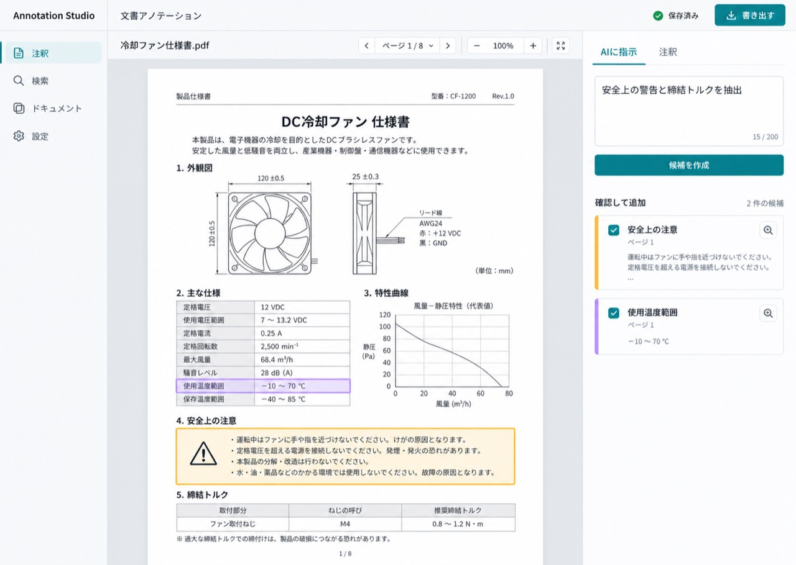

# Annotation Studio

[日本語](README.ja.md) | [English](README.md) | [简体中文](README.zh.md) · `README.md` は英語版を既定にしています。

PDF / Word / Excel / PowerPointをページ単位で読み、PNG / JPEG / WebP / TIFF画像も1ページの文書として扱う Document Annotation Agent の React + Node.js PoC です。指示とガイドラインに沿って注釈し、根拠が明確で確認要求のない結果は自動追加、曖昧な結果は人の確認キューに回します。

PDF / DOCX / PPTX / XLSX の変換は Node.js サーバー上の [`document-svg`](https://github.com/ryusui-hiro/document-svg) で行います。画像はサーバーで1ページのSVGプレビューに正規化します。APIキーはAI要求ごとにNode APIへ渡し、サーバー側では保存・ログ出力しません。

## 起動

Node.js 22 以降を使います。

```bash
npm install
cp .env.example .env
npm run create:demo
npm run dev
```

`http://127.0.0.1:5173` を開くとサンプル文書で画面を確認できます。手動注釈、ラベル・メモ編集、ページ切り替え、PNG抽出はキーなしでも使えます。AI設定がない場合、全ページに固定のデモ候補を表示します。デモ候補は実モデルの解析結果ではありません。

設定画面でOpenAI API、Azure OpenAI、OpenAI互換APIを選び、endpoint、API key、モデル、推論レベルを入力します。GPT-6 AstraとGPT-5.6 Sol / Terra / Lunaに対応します。Azureではendpoint、key、deployment名を入力します。サーバー環境変数 OPENAI_API_KEY / AZURE_OPENAI_* は、画面にAPIキーを入力しない場合のローカル用fallbackです。

APIキーは保存を選ばなければメモリにのみ保持され、再読み込み時に再入力が必要です。「この端末に保存」を有効にした場合はブラウザー/Tauri WebViewのlocalStorageに平文保存します。共有端末では無効にしてください。AI解析ではページ画像、位置を正規化した抽出テキスト、指示、ガイドライン、任意の修正ルール、人が確定した判断例を設定先へ送信します。文書全体を解析するとページごとにAgentを実行し、Tool操作に複数のモデル要求が必要な場合があります。実際のtoken usageと要求数を集計します。OpenAI Responses APIには `store: false` を設定し、SDK tracingは無効にしています。リモートAPIサーバーへ接続する場合はHTTPSを使ってください。

ビルドと本番モードの起動:

```bash
npm run build
npm test
npm start
```

`npm test` はスクリプトモデルでAgents SDKのTool実行を確認し、外部APIは呼び出しません。

## 今の範囲

- PDF / DOCX / PPTX / XLSX のアップロードと、`document-svg` によるページごとのSVG変換。PNG / JPEG / WebP / TIFF画像も1ページとして読み込み。
- 選択ツール、矩形領域注釈、色ラベル、注釈メモ、削除、一覧からの選択。
- 注釈領域を PNG でダウンロード。
- 自然言語のタスク例と編集可能なアノテーションガイドラインを使い、ページ単位または文書全体を順番に解析。
- 自然文からラベル、操作、曖昧時の対応、作業手順を持つAnnotation Taskを構成し表示。OpenAI / Azure / OpenAI互換API / Codex App Server接続時は構造化出力で計画し、各ページのAgentへ渡す。未接続時はローカル下書きと明示。
- テキストを抽出できるPDF / Office文書をガイドラインとして読み込み、編集可能なガイドライン欄へ追加。
- Observe / Suggest / Assist / Autopilotを選択。計画、ページ移動、SVGのテキスト・レイアウト確認、検索、注釈、レビュー、出力の作業ログを表示。
- OpenAI Agents SDKのサーバー側オーケストレーターが、文書アウトライン、ページ確認、既存注釈一覧、抽出テキスト検索、領域注釈、人の確認要求をToolとして実行。`select_text`は位置付きテキストを正規化ページ座標へ対応付け、`annotate_text`は一意な一致からテキスト根拠付きの領域候補を作成。該当なし・複数一致は確定しません。Assist / Autopilotで既存注釈の変更・削除を提案すると承認までRunを一時停止し、同じRunを再開。既存・確認待ち注釈は重複防止のため上限付き要約として渡す。Codex App Serverは構造化出力アダプターを継続使用。
- ユーザーが指示文でファイル出力を明示した場合、Agents SDK実行は対象範囲の確認後に`export_annotations`を呼び、元形式・JSON・CSVをAdapter経由で準備してダウンロード操作を表示。成果物は暗号化して30分保持し、未解決レビューがある間は元形式を出力しません。Codex App Serverではプロバイダー共通の画面上の書き出し操作を使います。
- PDF / OfficeのページプレビューとXLSXブックは、アウトライン・確認・検索を共通化するサーバー側`DocumentAdapter`を実装。`search_document`は文書全体を検索し、ページまたはシート・セル位置を返す。
- 同じAdapterがAgentツールの型付き注釈を保持し、JSON、CSV、PDF、DOCX、PPTX、XLSXの書き出しを`POST /api/documents/:documentId/export`にまとめます。アップロード元のバイト列はセッションで別に保持し、書き出しは新しいファイルを作ります。
- Orchestratorは、密な表や視覚的に曖昧なページを、読み取り専用の子Agent`Document Reader Agent`へ委譲できます。Readerは根拠と位置のヒントを返し、ラベル判断と注釈の権限はOrchestratorに残します。独立Validatorが文書全体を検査し、形式別Adapterが決定論的に書き出します。
- ユーザーが明示的にファイル出力を依頼した場合のみ`export_annotations` Toolを有効化し、指定範囲の読取り後にAdapterで出力を準備します。ダウンロード用ファイルは暗号化して最大30分保持し、画面にダウンロード操作を表示。未解決レビューがある間はネイティブ形式を書き出さず、JSON / CSVではレビュー状態を保持します。
- OpenAI Agents SDKの文書全体実行では、Agentが`navigate_page`を呼ぶと指定ページを画像としてモデルに返す。注釈はAgentが確認したページ位置を保持し、未訪問ページはホスト側が後続処理する。
- XLSXではOpenAI Agents SDKのAgentがシート構成とセル範囲を読み取り、列追加・セル書き込み・範囲書き込みを提案。Assist / Autopilotでは承認後に同じAgent Runを再開。一括実行ではブックのメモリ上で書き込み、次の文書へ進む。Codex App Serverはページ画像の確認には対応しますが、セル操作Toolは提供しません。
- Agent欄でシートのプレビューとセル変更履歴を確認し、承認済み変更を別の`-annotated.xlsx`としてダウンロード。アップロード元は上書きしない。処理済みの各プロジェクト文書は、サーバーセッションが有効な間、プロジェクト一覧から元形式の注釈付きコピー、構造化JSON、CSVを書き出せます。
- Assist / Autopilotでは曖昧な`request_review` ToolがAgents SDKのRunを中断。人が承認・却下すると同じ`RunState`を再開し、その後に残りのページを続行。保留Runと対応する文書セッションはAPIサーバーのローカルデータ領域へAES-GCM暗号化して保存し、最大30分、API再起動後も再開できます。APIキーは保存せず、再開時は現在のプロバイダー設定を使います。一括処理では曖昧な候補を文書ごとに残して次のファイルへ進みます。
- レビュー優先度、理由、原文抜粋を含む候補を生成。曖昧さと明示的な確認要求で人の判断が必要かを決め、任意の数値confidenceは補助メタデータとしてのみ保存し、自動適用の境界には使わない。
- 文書全体の解析後、選択中のプロバイダーを使う独立したAgents SDK Validatorがラベルの一貫性、根拠の妥当性、根拠不足を確認します。ルールベース検査でも同じ抜粋や実質的に似た表現のラベル違いを検出し、抜粋と該当ページを表示します。指摘は文書ワークスペースに保存され、最後の人の判断後に再確認します。Validatorは注釈を変更しません。独立確認が使えない場合も、ルールベースの指摘は残ります。
- 確認候補のラベルとメモを直して確定。元の不確かなTool提案を却下し、修正判断を同じAgent Runへ渡して残りのページにも適用。文書全体の修正ルールを追加して再解析する機能もあります。
- 注釈、確認待ち、却下履歴、タスク指示を文書ごとにブラウザーへ保存。
- 直近20回のAgent実行を文書ごとにブラウザーへ自動保存。状態、指示、日時、Activityを画面で確認し、JSONにも書き出し。履歴は暗号化されないため、共有端末では注意。
- ライブ注釈状態はページ領域・確認項目・Excel変更をまとめた正規化レコード1つで管理し、画面用の一覧はstatusから導出。新しい文書ワークスペースも同じレコード一覧を保存。既存のversion 2データも読み込み、次回保存時に新形式へ移行。
- フォルダーをプロジェクトとして開き、対応文書を一覧化。デスクトップ版はTauriのネイティブフォルダー選択と読み取り専用FSを使用し、対応Webブラウザーではフォルダーをアップロード。
- 選択した最大200文書の全ページへ同じAgent指示を順番に実行。曖昧な箇所は文書ごとの確認キューに残したまま次の文書へ進み、注釈と履歴を文書別に保存。
- フォルダー情報は端末に保存。アプリ再起動後はフォルダーへ再接続してアクセスを許可。Web版のファイル本体は現在のセッション中に保持。
- 注釈と確認待ちの構造化JSON / CSV、ページ画像に注釈枠を重ねたPDF、選択範囲PNGを出力。
- 構造化JSONにはページ領域とシートセル変更を共通形式で含め、文書ID、対象位置、根拠、説明、レビュー優先度、状態を記録。
- OpenAI Responses APIでページ画像から注釈候補を生成し、GPT-6 Astra / GPT-5.6 Sol / Terra / Lunaと推論レベルを選択。
- Azure OpenAI / OpenAI互換APIは設定画面のendpointとkeyで接続。Azure deployment名にも対応。
- Codex App ServerはローカルCodex CLIのモデルカタログ、推論レベル、thread単位token usageに接続。
- 入力 / 出力 / 推論 / cached / total token数をモデル別に記録し、設定画面で確認。
- Tauri 2のmacOS / Windows / Linuxデスクトップシェルを追加。
- 実行ごとの入力 / 出力 / 推論 / cache / total token usageを端末内に保存。

注釈入りPDFはページSVGの視覚的なコピーに枠と番号を付けて書き出します。承認済みのExcel変更は新しいブックへ、DOCX注釈は新しいWordファイルのコメントへ書き出せます。元ファイルは上書きしません。Wordコメントは段落構造が対応していれば一意な原文抜粋そのものにアンカーし、同じ段落に複数注釈がある場合は段落全体を共有アンカーにします。抜粋がない・見つからない・複数一致する場合はスキップ件数を報告します。承認済みPowerPoint注釈はスライド上に編集可能な枠・ラベルと、スライド単位のユーザー定義タグを追加します。タグには分類、根拠抜粋、説明、レビュー優先度、確定状態を名前／値の機械可読形式で保存し、既存の無関係なタグは保持します。タグはスライド上には表示せず、PowerPointのTags APIまたはOpen XMLから読み取れます。ラベル・理由・レビュー優先度・座標・任意の数値推定値はCSV / JSONに含まれます。

変換警告は画面に表示します。SVG は直接 HTML に挿入せず、画像として表示します。Codex App Serverは実行ホスト上のCodex CLIログインとモデルカタログを使います。macOSでは利用可能な場合にChatGPTアプリ同梱のCodex実行ファイルを優先し、`CODEX_APP_SERVER_BIN`で変更できます。Webでリモート公開する場合は、ローカル/社内APIサーバー上のCodex CLIを運用してください。TauriパッケージにはNode APIを同梱しないため、設定画面でローカルまたは社内API URLを指定してください。暗号化されたセッションデータの既定保存先は`~/.annotation-studio/session-state`です。別の場所を使う場合は`ANNOTATION_STUDIO_DATA_DIR`を設定してください。

## 参考資料の境界

古い PoC / フロントエンドは注釈ワークフローを理解するために参照しました。過去の README の配備先・コマンド・API URL は現在の要件や認証情報として引き継いでいません。詳しくは [`docs/reference-notes.md`](docs/reference-notes.md) を参照してください。

## 画面イメージ

今回のUI実装で参照した日本語イメージと、英語版の画面・ワークフローイメージです。




## 接続設定とデスクトップ版

- 設定画面で OpenAI API、Azure OpenAI、OpenAI互換API、Codex App Server を切り替えます。
- APIモードではエンドポイントとAPIキーを設定し、GPT-6 Astra / GPT-5.6 Sol / GPT-5.6 Terra / GPT-5.6 Luna、推論レベルを選べます。
- APIキーは通常は設定を保存しても端末へ書き込みません。明示的に「この端末に保存」を選んだ場合のみ、Web/TauriのWebViewストレージに保存されます。共有端末では無効にしてください。
- Codex App Serverモードは同じホスト上のCodex CLIを使います。CLIのログイン済みアカウント、利用可能モデル、推論設定を引き継ぎます。
- Tauri 2でデスクトップアプリをビルドできます。デスクトップ版は同じ文書処理APIを使うため、設定の「文書/APIサーバーURL」にローカルまたは社内で運用する Annotation Studio API を指定します。

Web開発:

```bash
npm run dev
```

Tauriデスクトップ開発:

```bash
npm run tauri:dev
```

Tauriパッケージ:

```bash
npm run tauri:build
```

Tauri配布版はNode APIサーバーを自動同梱しません。APIをローカルで起動するか、設定画面で到達可能な社内API URLを指定してください。ローカルAPIは127.0.0.1だけで待ち受けます。公開環境ではHOSTを明示した上で、認証付きリバースプロキシとHTTPSを設定し、CORS_ALLOWED_ORIGINSも配備先に限定してください。

Codex App Server用TypeScript wire schemaは、この開発環境のCodex CLIから生成しています。CLIを更新した場合は `codex app-server generate-ts --out server/codex-protocol` で再生成し、モデル一覧・reasoning effort・token usage通知を確認してください。
