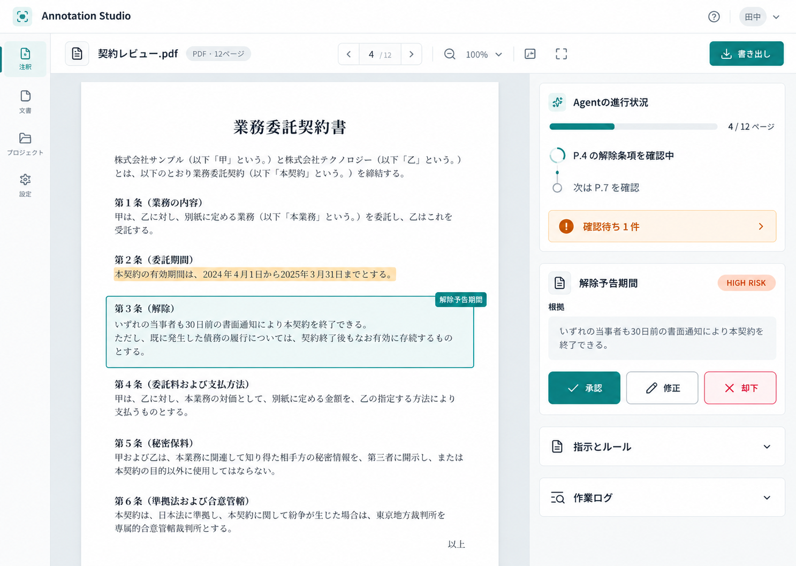
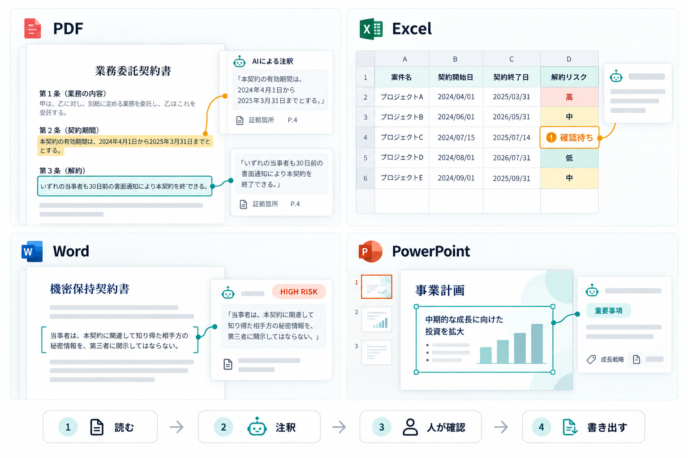

# Astra Annotator

[日本語](README.ja.md) | [English](README.md) | [简体中文](README.zh.md) · `README.md` は英語版を既定にしています。

PDF / Word / Excel / PowerPointをページ単位で読み、PNG / JPEG / WebP / TIFF画像も1ページの文書として扱う Document Annotation Agent の React + Node.js PoC です。指示とガイドラインに沿って注釈し、根拠が明確で確認要求のない結果は自動追加、曖昧な結果は人の確認キューに回します。

PDF / DOCX / PPTX / XLSX の変換は Node.js サーバー上の [`document-svg`](https://github.com/ryusui-hiro/document-svg) で行います。画像はサーバーで1ページのSVGプレビューに正規化します。APIキーはAI要求ごとにNode APIへ渡し、サーバー側では保存・ログ出力しません。

## 起動

Node.js 22 以降を使います。

```bash
npm install
cp .env.example .env
npm run create:demo
npm run dev
```

`http://127.0.0.1:5173` を開くと、既定の冷却ファン資料で画面を確認できます。手動注釈、ラベル・メモ編集、ページ切り替え、PNG抽出はキーなしでも使えます。通常のサンプルでは、AI未接続時に固定候補を表示することがあります。実モデルの解析結果ではありません。「契約レビュー例」は固定スクリプトの架空契約書デモです。別の「実AIデモ」メニューから、ラベル未記入の架空契約PDF、`Churn Risk`列が空欄の18件の顧客解約リスクExcel、または出力列が空欄の16件の顧客フィードバックExcelを個別に開けます。各デモは専用の指示とガイドラインを読み込みます。ファイルを開いただけではモデルを呼ばず、ユーザーがAgentの実行ボタンを押したときだけ解析を始めます。実AIデモはライブのAIプロバイダー接続が必須です。未接続で実行すると固定ラベルに置き換えず、設定画面を開きます。サンプルは合成データで、実在顧客の情報は含みません。契約例は法的助言ではありません。サンプルは`npm run create:termination-demo`、`npm run create:product-hunt-demo`、`npm run create:product-hunt-churn-demo`で再生成できます。Product Hunt用の実演手順、掲載文、事前確認は[demo kit](docs/product-hunt-demo-kit.md)を参照してください。

設定画面でOpenAI API、Azure OpenAI、OpenAI互換APIを選び、endpoint、API key、モデル、推論レベルを入力します。GPT-6 AstraとGPT-5.6 Sol / Terra / Lunaに対応します。Azureではendpoint、key、deployment名を入力します。サーバー環境変数 OPENAI_API_KEY / AZURE_OPENAI_* は、画面にAPIキーを入力しない場合のローカル用fallbackです。

APIキーは現在のブラウザータブのメモリにのみ保持し、ブラウザー/Tauri WebViewの保存領域には書き込みません。再読み込みまたはタブを閉じると消去されます。AI解析ではページ画像、位置を正規化した抽出テキスト、指示、ガイドライン、任意の修正ルール、人が確定した判断例を設定先へ送信します。文書全体を解析するとページごとにAgentを実行し、Tool操作に複数のモデル要求が必要な場合があります。実際のtoken usageと要求数を集計します。OpenAI Responses APIには `store: false` を設定し、SDK tracingは無効にしています。リモートAPIサーバーへ接続する場合はHTTPSを使ってください。

ビルドと本番モードの起動:

```bash
npm run build
npm test
npx playwright-cli install-browser chromium --only-shell
npm run test:browser-e2e
npm run test:agent-sse-browser-e2e
npm start
```

`npm test` はスクリプトモデルによるAgents SDKのTool実行と承認・再開、ローカルのResponses API Fixtureを使った修正ルール生成APIを確認し、外部プロバイダーは呼び出しません。プロセスAPIテストは実際のTask PlannerとAgents SDK経路をloopbackの偽Responses APIで通し、15ページの合成文書を1つのRunStateで移動し、14ページ目で高優先度候補を人の確認で中断、承認後は同じRunStateを15ページ目で再開して、人が承認した注釈と自動注釈をJSONへ書き出します。全文書APIは未確認ページがある場合に`incomplete`と正確な`remainingPages`を返し、全ページが確認済みになるまで出力を止めます。40ページのスクリプトテストは低詳細度の画像概要と有界なページ情報で12ページを超えて検査できることを確認し、121ページの大綱出力テストは大綱の件数・サイズ制限を検証します。Product Hunt用PDFのソーステストは11ページ・14条項で、分類ラベルが埋め込まれていないことを確認します。最終モデル応答を保留し、ページ移動・読取・スクロール・注釈の順序付きSSEが結果より先に届くことも検証します。ルール生成APIテストは厳密な出力Schema、長さ制限、文書根拠の非永続化も確認します。`npm run test:browser-e2e` は本番プレビューをビルド・起動し、デモPDFの確認・修正・却下・JSON出力に加え、開いただけで未確認のページが次の全文書区間の開始ページになること、変換警告を人が確認済みにすることでページ範囲確認を完了できること、SSEのページ移動・スクロールイベントでビューアが実際にページ2のハイライトへ移動する流れ、編集・承認した修正ルールが後続ページへ届く流れ、修正元が変わった際の古いルール案の破棄、保存済み注釈のValidator再確認、横長XLSXの列移動と変更前コンテキスト、異なる形式を含むフォルダーの一括処理と書き出し、失効した書き出しセッションの復旧、ブラウザー上のDOCX/PPTXアップロードとネイティブ出力を検証します。AI応答とブラウザーSSE活動はローカルのFixtureで、アップロード、変更登録、読み取り専用の原本コンテキスト取得は隔離したローカルAPIを使います。固定バージョンのPlaywright CLIでChromiumを操作します。

全文書のページ数はサーバーで開いた文書から確定し、検査済みページは原本ハッシュとタスク範囲に結び付けて暗号化セッションへ保存します。ブラウザーが送る`alreadyInspectedPages`だけではValidatorや書き出しゲートを解除できません。プロセスAPIテストでは、ページ数と全ページ検査済み一覧の偽装を試し、API再起動後も未検査ページが残るため検証・出力が止まることを確認します。

ユニットテストでは80ページの文書を模擬し、Agentが80ページ目を検索・移動してHuman Reviewで中断し、同じRunを再開することも確認します。別のプロセスAPIテストはAgents SDKのXLSX Toolで列作成、2段階の承認、読み戻し、ネイティブ出力を行い、ExcelJSで出力ファイルを独立して再読込し、元ファイルのバイト列が変わらないことを検証します。本番ブラウザーE2Eでは4モードをデスクトップ・モバイルで表示し、Autopilotが全文を処理して、明確な高優先度候補を適用・報告し、確認待ちを作らないことも確認します。

`npm run test:agent-sse-browser-e2e` は本番ビルドしたReact UIをChromiumで操作し、実際のTask PlannerとAgents SDKのExpress SSE経路を検証します。Responses APIはloopback上だけで待ち受ける偽サービスを使うため、外部プロバイダーは呼び出しません。ページ移動・スクロール・Human Reviewのストリームを確認した後、2ページ目のHIGH RISK候補をLOW RISKに修正し、生成されたルール案を残りページに適用すると明示的に採用します。元候補を拒否する`approved:false`の要求で同じAgent Runが再開し、3ページ目にLOW RISK注釈を付けること、JSON出力に2ページ目の人手修正と3ページ目の自動注釈の両方が含まれることを検証します。

`npm run test:office-native-export-libreoffice`はLibreOfficeをインストールした環境で任意に実行するネイティブ出力の受け入れテストです。合成DOCX / PPTXへ注釈を出力してLibreOfficeで保存・再読込し、WordコメントのアンカーとPowerPointの注釈図形が残ることを確認します。LibreOfficeでは保存時に独自のPowerPointタグ部分が失われます。このテストはMicrosoft Officeとの互換性や表示忠実度を保証しません。

実プロバイダーによる受け入れ確認を行う場合は、`ANNOTATION_STUDIO_LIVE_SMOKE=1`とOpenAI / Azure OpenAI / OpenAI互換APIの認証情報を設定して`npm run test:live-provider-smoke`を実行します。生成した架空PDFだけを使い、計画、Document Tool、Human Reviewでの中断・再開、JSON出力を確認します。プロバイダー料金が発生するため、既定のテストには含めません。

CIではUbuntu用の本番`.deb`もインストールし、`tauri-driver` / WebKitWebDriverでパッケージ版Tauriアプリを操作します。確認・JSON出力と、アプリ終了時に同梱APIが停止することを検証します。このテストはLinux専用で、他のOSではスキップします。

## 今の範囲

- PDF / DOCX / PPTX / XLSX / PNG / JPEG / WebP / TIFFの1ファイルを選択するか、画面にドラッグ＆ドロップして開く。PDF / Office文書は`document-svg`でページごとのSVGに変換し、画像は1ページとして表示。
- 選択ツール、矩形領域注釈、色ラベル、注釈メモ、削除、一覧からの選択。
- 注釈領域を PNG でダウンロード。
- 自然言語のタスク例と編集可能なアノテーションガイドラインを使い、ページ単位または文書全体を順番に解析。
- 自然文からラベル、操作、曖昧時の対応、作業手順を持つAnnotation Taskを構成し表示。OpenAI / Azure / OpenAI互換API / Codex App Server接続時は構造化出力で計画し、各ページのAgentへ渡す。未接続時はローカル下書きと明示。
- テキストを抽出できるPDF / Office文書をガイドラインとして読み込み、編集可能なガイドライン欄へ追加。
- Observe / Suggest / Assist / Autopilotを選択。計画、ページ移動、SVGのテキスト・レイアウト確認、検索、注釈、レビュー、出力の作業ログを表示。実行中・確認待ちは最新イベントをパネル上部に固定表示し、クリックすると全作業ログへ移動。
- OpenAI Agents SDKのサーバー側オーケストレーターが文書Toolを実行。`open_document`はユーザーが選択し、このRunにバインドされたセッションだけを開き、パスやURLを受け取りません。`get_document_info`はそのセッションの有界なメタデータを返し、`get_document_outline`はページまたはシートの構造を返します。その後、ページ確認、選択領域確認、既存注釈一覧、抽出テキスト検索、領域注釈、人の確認要求をToolとして実行。現在ページだけの実行では、人が見ている範囲と選択注釈をAgentの開始文脈へ渡してビューアーの位置を保持し、文書全体の実行は通常のページ計画から開始。`scroll_document`は拡大したページ画像を返し、ビューアーも同じ位置へスクロール。`select_text`は位置付きテキストを正規化ページ座標へ対応付け、`get_selected_region`はビューアーで選択中の領域をAgentへ渡し、`annotate_text`は一意な一致からテキスト根拠付きの領域候補を作成。該当なし・複数一致は確定しません。Assist / Autopilotで既存注釈の変更・削除を提案すると承認までRunを一時停止し、同じRunを再開。既存・確認待ち注釈は重複防止のため上限付き要約として渡す。Codex App Serverは構造化出力アダプターを継続使用。
- ユーザーが指示文でファイル出力を明示した場合、Agents SDK実行は対象範囲の確認後に`export_annotations`を呼びます。全文書の視覚文書を書き出す前に、Orchestratorが同じ実行内で読み取り専用Validatorを呼び、正規化された注釈スナップショットを検査します。検証に失敗した場合や注釈が変わった場合は、元形式・JSON・CSVの書き出しを止めます。Validatorの指摘はFinal Reviewへ返し、注釈の変更や承認には使いません。Adapterが決定論的な書き出しを行い、成果物は暗号化して30分保持します。元形式は未解決レビューがある間は出力しません。Codex App Serverではプロバイダー共通の画面上の書き出し操作を使います。
- PDF / OfficeのページプレビューとXLSXブックは、バインド済みセッションを開き、アウトライン・確認・検索を共通化するサーバー側`DocumentAdapter`を実装。`search_document`は文書全体を検索し、ページまたはシート・セル位置を返す。
- PDFの確認では、スタイルに基づく見出し候補と、同じベースラインに並ぶテキスト行のヒントも返します。これはナビゲーションとレイアウトの手掛かりであり、Agentがページ画像と照合します。PDFの意味的な見出し・表構造を確定するものではありません。
- 同じAdapterがAgentツールの型付き注釈を保持し、JSON、CSV、PDF、DOCX、PPTX、XLSXの書き出しを`POST /api/documents/:documentId/export`にまとめます。アップロード元のバイト列はセッションで別に保持し、書き出しは新しいファイルを作ります。
- Orchestratorは、密な表や視覚的に曖昧なページを、根拠と位置のヒントを返す読み取り専用の子Agent`Document Reader Agent`へ委譲できます。複雑な分類は最大12件のラベル案を返す読み取り専用の`Document Annotator Specialist`にも委譲できます。Annotatorはツールを持たず、抽出テキストが不完全でも画像上の根拠を保持し、人間の判断に付いた適用範囲を守ります。Orchestratorが各案を確認し、注釈と承認の権限を保持します。1ページにつき1回、1実行あたり最大24回まで委譲できます。全文書の明示的な視覚文書出力では、Validatorが同じOrchestrator実行内で決定論的な書き出しの直前に動きます。Agent内で出力しない通常の全文書実行は、従来どおりホスト側で最終確認します。
- ユーザーが明示的にファイル出力を依頼した場合のみ`export_annotations` Toolを有効化し、指定範囲の読取り後にAdapterで出力を準備します。全文書の視覚文書では、同一スナップショットを検証した成功済みValidator結果も必要です。ダウンロード用ファイルは暗号化して最大30分保持し、画面にダウンロード操作を表示。未解決レビューがある間はネイティブ形式を書き出さず、JSON / CSVではレビュー状態を保持します。XLSXは既存のブック確認・承認ゲートを使います。
- OpenAI Agents SDKの文書全体実行では、`navigate_page`で同じAgent RunStateのまま全文書を移動・確認できます。低詳細度のページ概要画像と有界なテキストで長文書のコンテキスト量を抑え、細かな文字や領域は`scroll_document`で高詳細度の切り抜きを確認します。注釈はAgentが実際に確認したページを保持します。`navigate_page`で開いただけのページは未確認として扱い、APIは`incomplete`と未確認ページ一覧を返します。RunStateが全ページを確認する前に終わった場合、最初の未確認ページから別の全文書区間を開始し、全ページの確認済みチェックポイントが揃うまでは全文書出力を許可しません。ページ移動ツールのないプロバイダーでは、ページ単位の処理と前ページの確認チェックポイントを使います。
- XLSXではOpenAI Agents SDKのAgentがシート構成とセル範囲を読み取り、列追加・セル書き込み・範囲書き込みを提案。Assistは明確な低・中優先度を適用し、高優先度または曖昧な変更は確認します。Autopilotは明確な変更を優先度に関係なく適用して高優先度の結果を報告し、判断が曖昧な場合だけ確認を待ちます。一括処理では曖昧な変更を文書ごとに保留しながら次のファイルへ進みます。Codex App Serverもサーバー側Adapterを通じて有界のセル範囲を読み、構造化した変更案を返します。Suggestではすべて確認待ちです。保留中の判断は文書IDとソースハッシュに結び付きます。
- 作業台にはPDF、Word、PowerPoint、Excelの対象形式を表示し、Agentの現在・次の操作、進捗、確認待ち件数を見える位置に保ちます。書き出しは形式に合うネイティブ出力を先頭にしたメニューから選べます。
- Excelの中央プレビューは選択中のシートに切り替わり、冒頭20行を16列ずつ表示します。列ページを切り替えると、プレビュー先頭80列を確認でき、変更カードから対象セルへ移動できます。変更カードでは確認待ち・承認済み・却下済みのいずれも、アップロード元の周辺5行×8列を読み込めます。プレビュー外の対象範囲も5行×8列ずつ切り替え、提案全体を確認できます。この読み取りは変更IDに結び付き、AIプロバイダーへ送信されません。長いセル値は300文字で省略します。承認済み変更は別の`-annotated.xlsx`としてダウンロードし、アップロード元は上書きしません。処理済み文書の元形式注釈付きコピー、構造化JSON、CSVはプロジェクト一覧から書き出せます。サーバーセッションが失効している場合は、接続中のフォルダーから元文書を再度開き、保存済みのsource hashと一致することを確認してから書き出します。
- Assist / Autopilotでは曖昧な`request_review` ToolがAgents SDKのRunを中断。人が承認・却下すると同じ`RunState`を再開し、その後に残りのページを続行。保留Runと対応する文書セッションはAPIサーバーのローカルデータ領域へAES-GCM暗号化して保存し、最大30分、API再起動後も再開できます。APIキーは保存せず、承認時は保存済みRunを同じプロバイダー・モデルの現在の有効な認証情報へ再接続します。暗号化チェックポイントが保存できなかった場合は、同じAPIプロセスの元のProvider設定が保たれているときだけ続行できます。一括処理では曖昧な候補を文書ごとに残して次のファイルへ進みます。
- レビュー優先度、理由、原文抜粋を含む候補を生成。曖昧さと明示的な確認要求で人の判断が必要かを決め、任意の数値confidenceは補助メタデータとしてのみ保存し、自動適用の境界には使わない。
- 文書全体の解析後、選択中のプロバイダーを使う独立したAgents SDK Validatorがラベルの一貫性、根拠の妥当性、根拠不足を確認します。ルールベース検査でも同じ抜粋や実質的に似た表現のラベル違いを検出し、抜粋と該当ページを表示します。指摘は文書ワークスペースに保存され、最後の人の判断後に再確認します。保存済み注釈もFinal Reviewからページ解析をやり直さずに再確認できます。Validatorは注釈を変更せず、処理中に文書や注釈が変わった場合は古い結果を反映しません。独立確認が使えない場合も、ルールベースの指摘は残ります。
- 確認候補のラベルとメモを修正して確定。初期設定はその候補だけに適用します。全ページ実行に続きがある場合、選択中のプロバイダーにタスク、根拠、修正から狭いルール案を作らせ、内容を編集・確認して明示的に適用できます。安全に一般化できない修正ではルール案を作らず、その理由を表示します。中断したページの複数判断は順番を保ち、後続ページへ渡すのは人が明示的に採用したルールのみです。作業履歴には各判断の内容、対象候補、適用範囲を記録し、残りページ向けルールは版番号と適用開始ページを保存します。ページ確認状況、ページ移動、確認漏れや変換警告のあるページの再確認も提供します。文字抽出のないページを画像で確認した場合や、変換警告を目視確認した場合は、人が制約を明示的に了承できます。複数候補を同じページで確定した際の確認件数も作業履歴に反映します。
- 注釈、確認待ち、却下履歴、タスク指示を文書ごとにブラウザーへ保存。XLSXは、保存したワークスペースと元ファイルのSHA-256が一致する場合に限り、開き直した新しいAPIセッションへ注釈・提案・確認結果を復元します。内容が変わったブックには古い変更を引き継ぎません。
- 直近20回のAgent実行を文書ごとにブラウザーへ自動保存。状態、指示、日時、Activityを画面で確認し、JSONにも書き出し。履歴は暗号化されないため、共有端末では注意。
- ライブ注釈状態はページ領域・確認項目・Excel変更をまとめた正規化レコード1つで管理し、画面用の一覧はstatusから導出。新しい文書ワークスペースも同じレコード一覧を保存。既存のversion 2データも読み込み、次回保存時に新形式へ移行。
- フォルダーをプロジェクトとして開き、対応文書を一覧化。デスクトップ版はTauriのネイティブフォルダー選択と読み取り専用FSを使用し、対応Webブラウザーではフォルダーをアップロード。
- 選択した最大200文書の全ページへ同じAgent指示を順番に実行。曖昧な箇所は文書ごとの確認キューに残したまま次の文書へ進み、注釈と履歴を文書別に保存。
- フォルダー情報は端末に保存。アプリ再起動後はフォルダーへ再接続してアクセスを許可。Web版のファイル本体は現在のセッション中に保持。
- 注釈と確認待ちの構造化JSON / CSV、ページ画像に注釈枠を重ねたPDF、選択範囲PNGを出力。
- 構造化JSONにはページ領域とシートセル変更を共通形式で含め、文書ID、対象位置、根拠、説明、レビュー優先度、状態を記録。状態は自動追加・確認待ち・提案どおりの承認・人の修正・却下を区別します。
- OpenAI Responses APIでページ画像から注釈候補を生成し、GPT-6 Astra / GPT-5.6 Sol / Terra / Lunaと推論レベルを選択。
- Azure OpenAI / OpenAI互換APIは設定画面のendpointとkeyで接続。Azure deployment名にも対応。
- Codex App ServerはローカルCodex CLIのモデルカタログ、推論レベル、thread単位token usageに接続。
- 入力 / 出力 / 推論 / cached / total token数をモデル別に記録し、設定画面で確認。
- Tauri 2のmacOS / Windows / Linuxデスクトップシェルを追加。
- 実行ごとの入力 / 出力 / 推論 / cache / total token usageを端末内に保存。

元のPDFから出力する注釈入りPDFは、ページ内容を保持したままベクターの枠と番号を重ねるため、本文検索を維持します。Office文書や画像からPDFを出力する場合は、レンダリング済みページの視覚コピーになります。承認済みのExcel変更は新しいブックへ、DOCX注釈は新しいWordファイルのコメントへ書き出せます。元ファイルは上書きしません。対応する段落構造では、Wordコメントは一意な原文抜粋の正確な範囲にアンカーします。正規化された引用の前後文脈で、重複する語句を特定できます。範囲がない・曖昧・未対応の入れ子構造の場合は、段落全体へ広げずスキップして報告します。承認済みPowerPoint注釈はスライド上に編集可能な枠・ラベルと、スライド単位のユーザー定義タグを追加します。複数行のテキスト選択は行ごとに分割した枠になり、各図形には安定したAnnotation Studio注釈IDが付きます。ネイティブPPTX出力はTransitionalとStrictの両OOXML名前空間形式を読み書きします。タグにはスライド座標、テキスト断片とセレクター、分類、根拠抜粋、説明、レビュー優先度、確定状態を名前／値の機械可読形式で保存し、既存の無関係なタグは保持します。タグはスライド上には表示せず、PowerPointのTags APIまたはOpen XMLから読み取れます。ラベル・理由・レビュー優先度・座標・任意の数値推定値はCSV / JSONに含まれます。LibreOffice 26.2では編集可能な図形の表示を確認しましたが、保存後の再読込時にカスタムスライドタグが失われました。Microsoft Officeでの確認はできていません。

変換警告は画面に表示します。SVG は直接 HTML に挿入せず、画像として表示します。Codex App Serverは実行ホスト上のCodex CLIログインとモデルカタログを使います。macOSでは利用可能な場合にChatGPTアプリ同梱のCodex実行ファイルを優先し、`CODEX_APP_SERVER_BIN`で変更できます。Webでリモート公開する場合は、ローカル/社内APIサーバー上のCodex CLIを運用してください。TauriパッケージにはNode API、対象OS用の依存パッケージ、既定の冷却ファンPDF、固定表示用の契約書PDF、11ページ・14条項の未分類Product Hunt契約書PDF、顧客フィードバックExcel、顧客解約リスクExcelを同梱し、ステージングテストで各サンプルを変更せずにコピーすることを確認します。起動時にAPIをloopback上で開始し、終了時に停止します。サーバーURLを空欄にすると同梱APIを使い、ローカルまたは社内APIのURLを入力するとそちらを使います。デスクトップ版の暗号化セッションデータはOSのアプリデータ領域に保存します。Webサーバーの既定保存先は`~/.annotation-studio/session-state`です。`ANNOTATION_STUDIO_DATA_DIR`で変更できます。

## 参考資料の境界

古い PoC / フロントエンドは注釈ワークフローを理解するために参照しました。過去の README の配備先・コマンド・API URL は現在の要件や認証情報として引き継いでいません。詳しくは [`docs/reference-notes.md`](docs/reference-notes.md) を参照してください。

## 画面イメージ

今回のUI実装で参照した日本語イメージと、英語版の画面・ワークフローイメージです。







## 接続設定とデスクトップ版

- 設定画面で OpenAI API、Azure OpenAI、OpenAI互換API、Codex App Server を切り替えます。
- APIモードではエンドポイントとAPIキーを設定し、GPT-6 Astra / GPT-5.6 Sol / GPT-5.6 Terra / GPT-5.6 Luna、推論レベルを選べます。
- APIキーは端末へ保存されません。現在のブラウザータブのメモリにのみ保持します。
- Codex App Serverモードは同じホスト上のCodex CLIを使います。CLIのログイン済みアカウント、利用可能モデル、推論設定を引き継ぎます。
- Tauri 2デスクトップ版は文書処理APIを同梱して自動起動します。設定のサーバーURLを空欄にすると同梱APIを使い、URLを指定するとローカルまたは社内APIに接続します。

Web開発:

```bash
npm run dev
```

Tauriデスクトップ開発:

```bash
npm run tauri:dev
```

Tauriパッケージ:

```bash
npm run tauri:build
```

Tauriビルド時にNode.js 24.21.0 LTSとAPI、本番依存パッケージを対象OS向けに用意します。Node.js配布物は公式SHA-256マニフェストで検証します。ネイティブビルドでは同梱APIを起動して疎通を確認し、親プロセスとのstdinパイプを閉じたときに子プロセスも終了することを検証します。アプリは127.0.0.1だけで待ち受け、ヘルスチェックが通るまで待機し、ポート競合時は別ポートを選び、終了時にAPIプロセスを停止します。macOS x64 / arm64、Windows x64 / arm64、Linux GNU x64 / arm64のネイティブビルドに対応します。`npm run tauri:build`は配布対象OS上で実行してください。Tauri CLIは対象のRust target tripleをフックへ自動で渡します。Tauri CLIを介さずにRuntimeだけ用意する場合は、対象tripleを`ANNOTATION_STUDIO_TARGET_TRIPLE`に設定します。`tauri:dev`では従来通り`npm run dev`がAPIを起動します。公開Web環境ではHOSTを明示し、認証付きリバースプロキシとHTTPSを設定し、CORS_ALLOWED_ORIGINSには配備先のOriginを完全一致で設定してください。同一Originの暗黙許可はloopbackホストに限定されます。

Codex App Server用TypeScript wire schemaは、この開発環境のCodex CLIから生成しています。CLIを更新した場合は `codex app-server generate-ts --out server/codex-protocol` で再生成し、モデル一覧・reasoning effort・token usage通知を確認してください。
