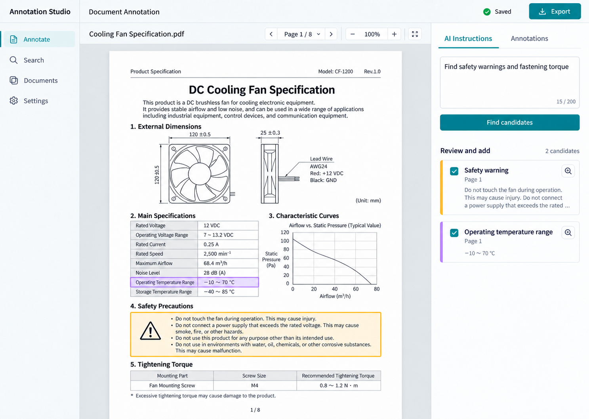
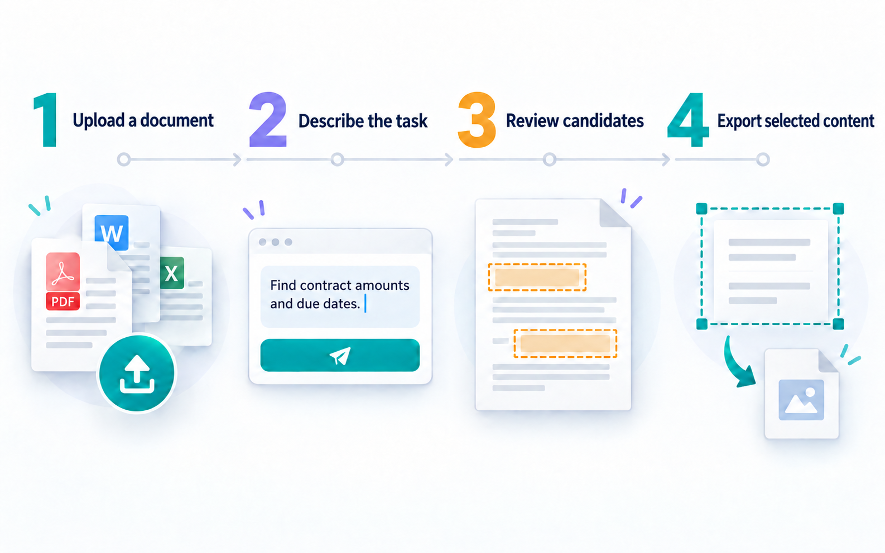

# Annotation Studio

[English](README.md) | [日本語](README.ja.md) | [简体中文](README.zh.md)

Default language: English.

Annotation Studio is a React and Node.js proof of concept for a document annotation agent. It reads PDF, Word, Excel, and PowerPoint files page by page, and can also inspect PNG, JPEG, WebP, and TIFF images as single-page documents. It follows natural-language instructions and annotation guidelines, and marks relevant regions. Clear, evidence-backed results that do not request review are added automatically; ambiguous results go to a human review queue.

PDF / DOCX / PPTX / XLSX conversion is handled by [`document-svg`](https://github.com/ryusui-hiro/document-svg) on the Node.js server. Raster images are normalized into one-page SVG previews on the server. API keys are passed to the local API for each AI request and are not stored or logged by the server.

## Get started

Use Node.js 22 or later.

```bash
npm install
cp .env.example .env
npm run create:demo
npm run dev
```

Open `http://127.0.0.1:5173` to try the sample document. Manual annotations, label and note editing, page navigation, and PNG extraction work without an API key. When AI is not configured, the app shows fixed demo candidates across the document; these are not model-generated results.

In Settings, choose OpenAI API, Azure OpenAI, or an OpenAI-compatible API and enter the endpoint, API key, model, and reasoning level. GPT-6 Astra and GPT-5.6 Sol / Terra / Luna are supported. Azure also requires a deployment name. Local environment variables such as `OPENAI_API_KEY` and `AZURE_OPENAI_*` are fallback values when no key is entered in the app.

Unless “Remember on this device” is enabled, the API key stays in memory and must be entered again after a reload. When enabled, it is stored as plain text in the browser or Tauri WebView `localStorage`; leave this option off on shared devices. AI analysis sends page images, extracted text with normalized locations, instructions, guidelines, optional correction rules, and human-confirmed decisions to the configured provider. A full-document scan runs an agent turn for each page; function-tool calls may require multiple model requests, and the app records actual token usage and request counts. OpenAI Responses API requests use `store: false`, and SDK tracing is disabled. Use HTTPS when connecting to a remote API server.

Build and run the production app:

```bash
npm run build
npm test
npm start
```

`npm test` exercises the Agents SDK tool loop with a scripted model and does not call an external API.

## Features

- Upload PDF, DOCX, PPTX, and XLSX files and convert them to page SVGs with `document-svg`; upload PNG, JPEG, WebP, and TIFF images as single-page previews.
- Add and edit rectangular annotations, color labels, and notes; select, delete, or extract a region as PNG.
- Use task presets and editable annotation guidelines to analyze one page or the whole document sequentially.
- Convert a natural-language request into a visible Annotation Task plan with labels, actions, uncertainty policy, and workflow. With OpenAI, Azure, OpenAI-compatible, or Codex App Server configured, the planner uses strict structured output; the agent receives that plan on each page. Without a provider, a clearly marked local draft is used.
- Import a text-based PDF or Office document as a guideline source; its extracted text is added to the editable guideline field.
- Choose Observe, Suggest, Assist, or Autopilot. A live activity stream reports task planning, page navigation, SVG text/layout inspection, search, annotation, review, and export actions.
- The server-side OpenAI Agents SDK orchestrator uses document tools for outlining, page inspection, listing existing annotations, extracted-text search, region annotation, and human-review requests. `select_text` resolves positioned text to normalized page bounds, and `annotate_text` uses a unique match to create a text-backed region; missing or repeated matches are not silently applied. In Assist / Autopilot, proposed updates and deletions of existing annotations pause for approval and resume the same run. Existing and review-queue annotations are sent as bounded summaries so the Agent can avoid duplicates. Codex App Server keeps its structured-output adapter.
- When the user explicitly requests a file in the task, the Agents SDK run can call `export_annotations` after its requested scope is inspected. It prepares native, JSON, or CSV output through the document adapter and returns a download action. The encrypted artifact expires after 30 minutes; native export waits for unresolved reviews. Codex App Server tasks use the provider-independent UI export actions.
- PDF / Office page previews and XLSX workbooks implement a shared server-side `DocumentAdapter` contract for outlines, inspection, and search. `search_document` returns page or sheet-cell locations across the current document adapters.
- The same adapter owns typed annotation records from Agent tool calls and routes JSON, CSV, PDF, DOCX, PPTX, and XLSX output through `POST /api/documents/:documentId/export`. The session keeps the uploaded source bytes separate; native exports are new files.
- The Orchestrator can delegate a dense or visually ambiguous page to a nested, read-only `Document Reader Agent`. It returns bounded evidence and layout hints; the Orchestrator keeps classification and annotation authority. The independent Validator reviews the completed document, and format adapters perform deterministic exports.
- If the user's instruction explicitly asks for a file, `export_annotations` becomes available only after the requested page or workbook scope has been read. It prepares a deterministic adapter export, encrypts the download artifact at rest for up to 30 minutes, and surfaces a download action; native output waits for unresolved review items, while JSON / CSV preserve their review status.
- In full-document OpenAI Agents SDK runs, `navigate_page` renders the requested page back to the model as an image tool result; annotations carry the page the Agent actually inspected. If it does not visit every page, the host processes the remaining pages.
- For XLSX workbooks, the OpenAI Agents SDK Agent can inspect sheet outlines and bounded cell ranges, propose output columns, and write cell or range values. Assist / Autopilot pause for approval and resume the same Agent Run; workspace batch writes into each in-memory workbook and continues to the next file. Codex App Server currently handles visual page review but does not expose the workbook cell tools.
- Inspect a workbook's sheet preview and cell-change history in the Agent panel. Download approved workbook changes as a new `-annotated.xlsx` copy; the uploaded source remains unchanged. For any processed workspace document, export its native annotated copy, structured JSON, or CSV from the project list while its server session is active.
- In Assist / Autopilot, an ambiguous `request_review` tool call interrupts the Agents SDK run. After approval or rejection, the same `RunState` resumes before the viewer processes remaining pages. Pending runs and their source document sessions are AES-GCM encrypted in the API server's local data directory and can resume after an API restart for up to 30 minutes. API keys are not saved; resume requests use the current provider settings. Workspace batch mode queues uncertainty per document and proceeds to the next file.
- Generate candidates with qualitative review priority, rationale, and a short source excerpt. Ambiguity and explicit review requests determine whether a person must decide; an optional numeric confidence estimate is metadata only and never an application threshold.
- Whole-document runs end with an independent Agents SDK Validator that checks label consistency, evidence support, and missing evidence using the selected provider. Deterministic checks also flag exact or substantially similar excerpts with different labels. Findings link to affected pages, are saved with the document workspace, and are rechecked after the final human decision; the Validator never changes annotations. If the independent check is unavailable, deterministic findings remain available.
- Edit a candidate's label and note before confirming it. The original uncertain tool proposal is rejected, the corrected decision is passed back to the same Agent Run, and remaining pages receive that example. You can also add a document-wide correction rule and re-run the full document.
- Automatically save the latest 20 agent runs per document in browser storage, including status, task, timestamps, and activity events. View past runs and export history as JSON. History is unencrypted in this browser profile.
- Keep live annotation state in one normalized record store for page regions, review items, and spreadsheet changes; the viewer derives its display queues by status. New document workspaces save that same record list. Existing version 2 workspaces remain readable and convert to the new format on the next save.
- Save annotations, pending reviews, rejection history, and task instructions per document in the browser.
- Open a project folder as a workspace. Tauri desktop uses its native folder picker and read-only filesystem access; compatible web browsers use a folder upload. The project lists up to 200 supported documents and lets you select a subset.
- Run one Agent instruction across every selected document and all of its pages. Batch mode continues to the next document while ambiguous regions remain in that document's review queue; each document's annotations and run history are stored separately.
- Project file metadata is saved locally. After restarting the app or reloading the web page, reconnect the folder to grant access again; web browser file handles remain in the current session only.
- Export structured JSON / CSV, an annotated PDF, and selected regions as PNG.
- Structured JSON includes normalized records for page regions and sheet-cell changes with document ID, target, evidence, explanation, review priority, and status.
- Use GPT-6 Astra / GPT-5.6 Sol / Terra / Luna with OpenAI Responses API, Azure OpenAI, an OpenAI-compatible endpoint, or Codex App Server. Select the reasoning level in Settings.
- Use the local Codex CLI model catalog, reasoning settings, and per-thread token usage through Codex App Server.
- Review input, output, reasoning, cached-input, and total token usage by model in Settings.
- Build a Tauri 2 desktop shell for macOS, Windows, and Linux.

The annotated PDF is a visual copy of the rendered pages with annotation outlines and number markers. Approved Excel cell changes are exported as a new workbook, and approved DOCX annotations can be exported as Word comments in a new file; neither overwrites the source. Word comments anchor to the exact unique excerpt when the paragraph uses supported text runs; several annotations in one paragraph use a shared paragraph anchor. Missing or ambiguous excerpts are skipped and reported. Approved PowerPoint annotations are exported as editable outline and label shapes and slide-level user-defined tags. The tags store categories and findings with evidence, explanation, review priority, and status as machine-readable name/value properties; unrelated existing tags are preserved. They are available through the PowerPoint Tags API or Open XML, rather than displayed on the slide canvas. Labels, rationales, review priority, coordinates, and any optional model estimate are included in CSV / JSON.

Conversion warnings are shown in the app. SVG is displayed as an image rather than inserted directly into HTML. Codex App Server uses the Codex CLI login and model catalog on the host running the server. On macOS, the ChatGPT-bundled Codex executable is preferred when it is available; set `CODEX_APP_SERVER_BIN` to override it. For remote web deployments, operate the API server and Codex CLI on a local or company host. The Tauri package does not bundle the Node API, so point Settings to a local or company API URL. The default encrypted session data directory is `~/.annotation-studio/session-state`; set `ANNOTATION_STUDIO_DATA_DIR` to use a different location.

## Screen concepts

The English screen concept and workflow guide show the intended annotation experience.





## Reference material

Earlier proof-of-concept files were used only to understand the annotation workflow. Their old deployment targets, commands, and API URLs are not carried forward as current requirements or credentials. See [`docs/reference-notes.md`](docs/reference-notes.md).

## API and desktop settings

- Settings can switch between OpenAI API, Azure OpenAI, OpenAI-compatible API, and Codex App Server.
- API mode supports endpoints and API keys, GPT-6 Astra / GPT-5.6 Sol / Terra / Luna, and reasoning levels. Azure also uses a deployment name.
- API keys are not written to device storage unless “Remember on this device” is explicitly enabled. The key is stored in browser / Tauri WebView storage as plain text when enabled; keep it off on shared devices.
- Codex App Server uses the Codex CLI on the same host, including its signed-in account, available models, and reasoning settings.
- Tauri 2 desktop builds use the same document-processing API. Set a reachable local or company Annotation Studio API URL in Settings.

Start web development:

```bash
npm run dev
```

Start Tauri desktop development:

```bash
npm run tauri:dev
```

Build the Tauri package:

```bash
npm run tauri:build
```

The Tauri package does not start the Node API automatically. Run the API locally or configure a reachable internal API URL. The local API listens on `127.0.0.1`. For a public deployment, set `HOST` explicitly, use an authenticated reverse proxy with HTTPS, and restrict `CORS_ALLOWED_ORIGINS` to the deployment origins.

The Codex App Server TypeScript wire schema was generated from the Codex CLI available in this development environment. After updating the CLI, regenerate it with `codex app-server generate-ts --out server/codex-protocol` and verify model discovery, reasoning levels, and token-usage notifications.
