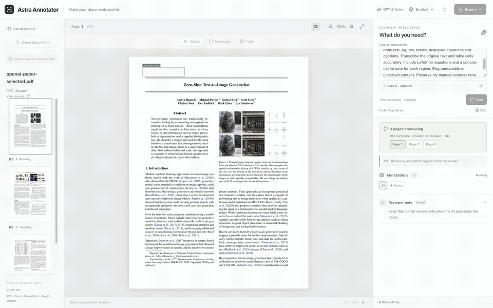
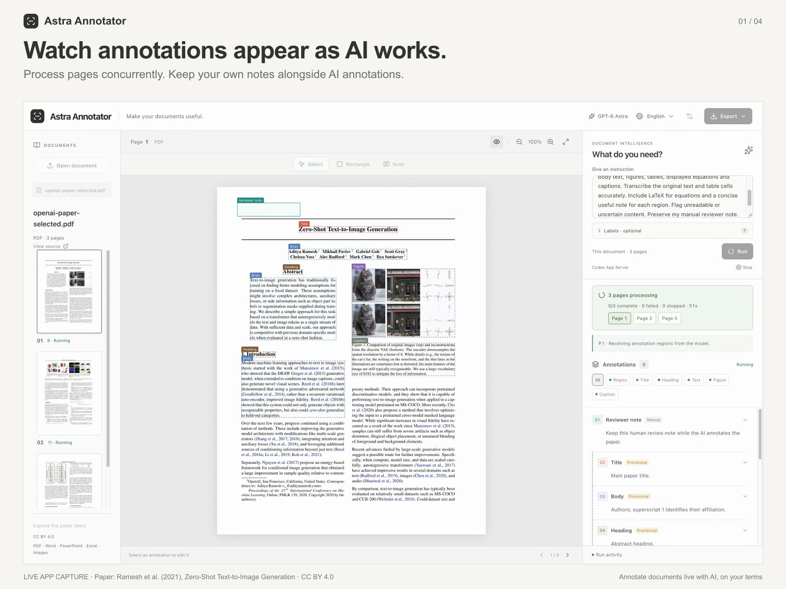
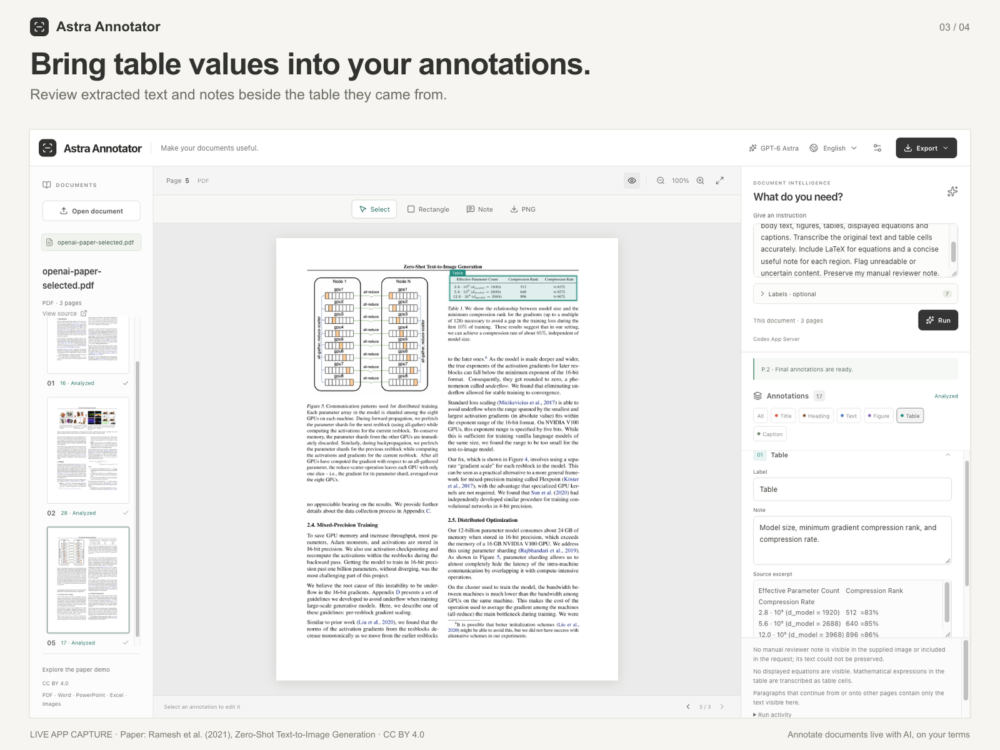

# Astra Annotator

**Annotate documents live with AI, on your terms.**

[Open the app](https://ryusui-hiro.github.io/DocumentAnnotationAgent/) · [Source code](https://github.com/ryusui-hiro/DocumentAnnotationAgent) · [日本語](README.ja.md) · [简体中文](README.zh.md)

Tell Astra what matters in a document. Watch annotations arrive, refine them by hand, and take the useful parts with you.



*Actual English recording, annotation phase only, 4× playback. Three pages were processed concurrently by GPT-6 Astra through the local Codex App Server. The app retained a human note and respected seven exact label names. This is recorded model output, not simulated animation. The source is the [OpenAI DALL·E paper](https://proceedings.mlr.press/v139/ramesh21a.html), selected pages 1, 2 and 5, under CC BY 4.0.*

## Use the hosted app

1. Open **[Astra Annotator](https://ryusui-hiro.github.io/DocumentAnnotationAgent/)**.
2. Open a PDF, Office document or supported image. You can add rectangles, labels and notes immediately.
3. For AI, open **Connection settings** and enter your HTTPS API endpoint and API key. The provider must support the OpenAI Responses API, image input, structured output, streaming and browser CORS.
4. Write an instruction and select **Run**. Up to three pages run at once. Labels are generated from your instruction unless you supply exact names and definitions under **Labels · optional**.

The website is a static GitHub Pages app. Files are processed in your browser; page images are sent to your configured provider only when you run AI. Your key stays in the current tab's memory, is never included in the published code, and is cleared on reload. API usage is billed by your provider. Export your work before closing the tab.

**Explore the paper demo** loads saved, real GPT-6 Astra results without making a model request. A new Run uses your own connection.

## What you can do

- Import multiple documents into one uncluttered workspace.
- Draw a region or add a note yourself; edit labels, excerpts and LaTeX.
- Give natural-language instructions without choosing a task mode first.
- Watch validated regions arrive before the final model response. Incomplete results remain unconfirmed.
- Keep manually created or edited annotations when you rerun AI.
- Generate labels dynamically, or enforce your own exact label names and definitions.
- Extract PNG regions, text, tables and mathematical expressions.
- Export annotated PDFs, JSON, CSV, Markdown and ZIP collections.
- Switch between English (default), Japanese and Simplified Chinese without changing source text.

## Browser and local capabilities

| Capability | GitHub Pages / browser only | Local or connected document server |
| --- | --- | --- |
| PDF rendering | PDF.js; source pages stay local | `document-svg` plus verified demo rendering |
| PNG / JPEG / WebP | Browser image decoder | Server image decoder |
| TIFF | Depends on browser decoder; use PNG or a server if unsupported | Supported single-page images |
| DOCX / PPTX / XLSX | Text-focused, reflowed previews with layout warnings | Native conversion previews; review conversion warnings |
| AI | Your API key and a CORS-enabled Responses endpoint | OpenAI, Azure, compatible API or authenticated Codex App Server |
| Annotated PDF / PNG / JSON / CSV / Markdown | Yes | Yes |
| Native DOCX / PPTX exports; spreadsheet cell workflows | Connect a document API server | Supported in the relevant local workflows |

Browser Office previews do not preserve the original page layout. They make the content available for annotation and extraction. For native Office output or Codex, run the local version or enter an accessible **Document server** URL in Settings. GitHub Pages itself cannot start a CLI. A remote document server must allow the Pages origin through CORS; use HTTPS and authentication when exposing one remotely.

## Run locally

Use Node.js **22.13 or newer**.

```bash
npm ci
npm run build
npm start
```

Open [localhost:3001](http://127.0.0.1:3001). The local default is **Codex App Server / GPT-6 Astra**, using your signed-in Codex CLI. Alternatively, configure an API provider in Settings. API keys are not stored in browser storage. For development, run `npm run dev` and open port 5173.

Build the static app with `npm run build:pages`; its output is `dist-pages/`, configured for `/DocumentAnnotationAgent/`. The [Pages workflow](.github/workflows/pages.yml) tests the static build before publishing `main`.

## Verification and limitations

The recorded three-page run returned **60 AI annotations plus one preserved manual note** in about **124 seconds**. Every AI label matched the seven supplied names. Two model findings remained uncertain. This demonstrates the workflow, not a benchmark of OCR accuracy: small lettering, mathematical glyphs and complex tables still need review.

```bash
npm test
npm run lint
npm run build
npm run build:pages
npm run test:static-pages
npm run test:browser-e2e
npm run test:agent-sse-browser-e2e
```

Default tests use fixtures and make no paid model calls. Live scripts require an explicit opt-in. Empty or interrupted responses show actionable errors; uploads and model calls are not silently replayed.

- [Recorded run and evidence](docs/live-paper-recording.md)
- [Paper source, license and reproduction](docs/paper-ocr-demo.md)
- [Advanced local workflows and architecture](docs/advanced-workflows.md)
- [English launch listing and upload assets](docs/product-hunt/launch-listing.en.md)
- [Third-party notices](THIRD_PARTY_NOTICES.md)

## Screenshots




